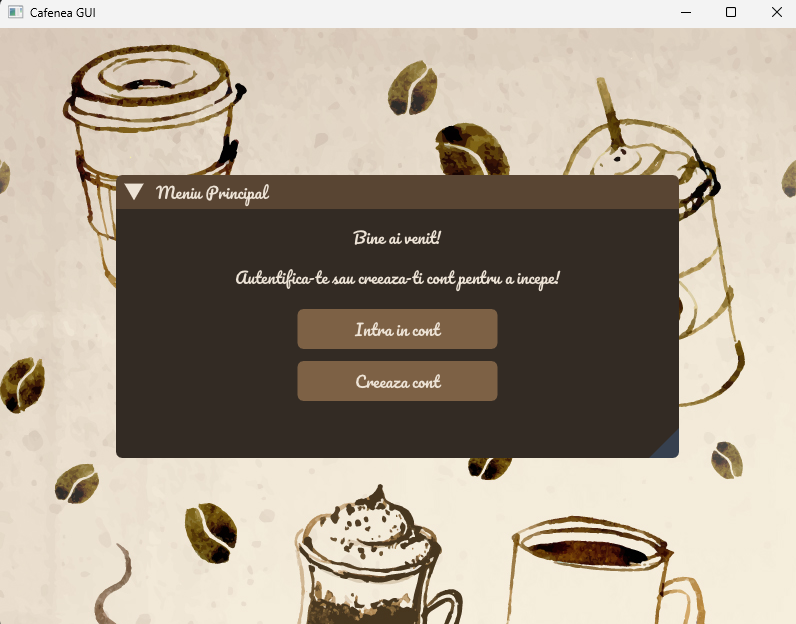
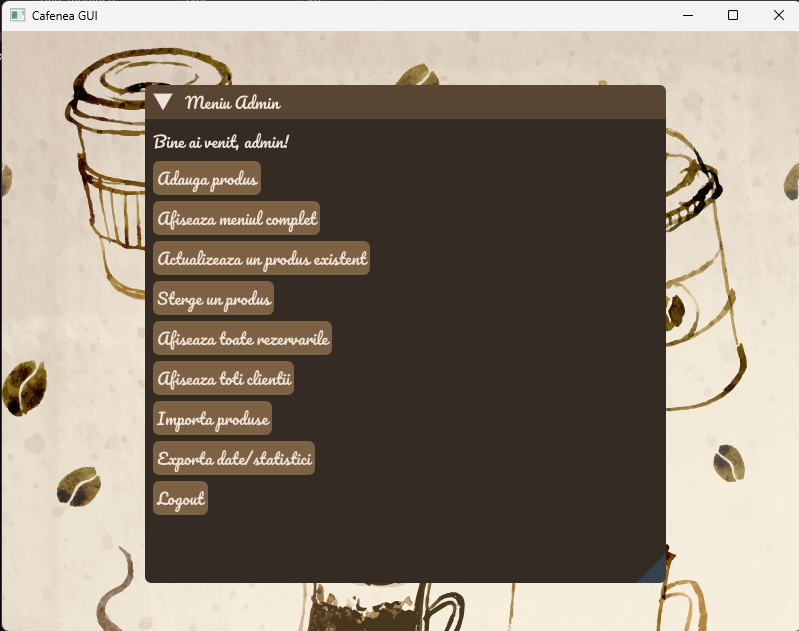
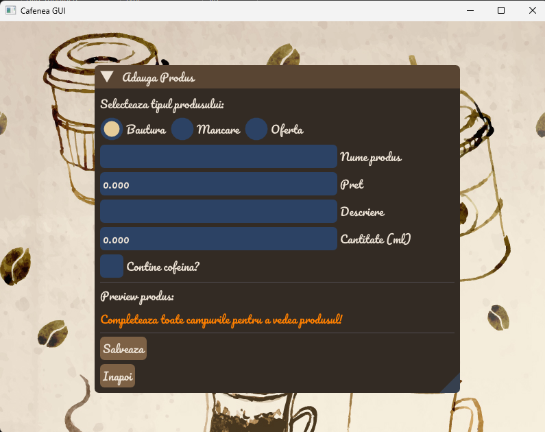
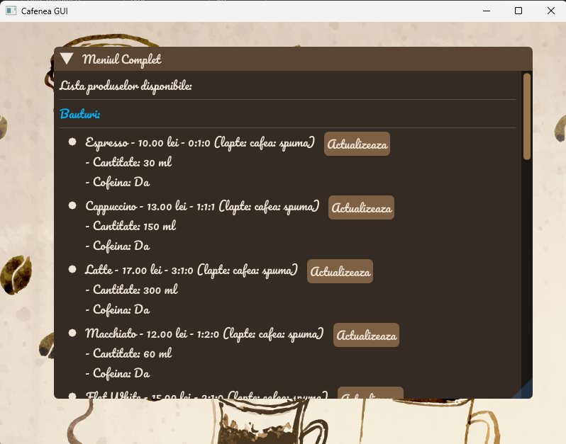
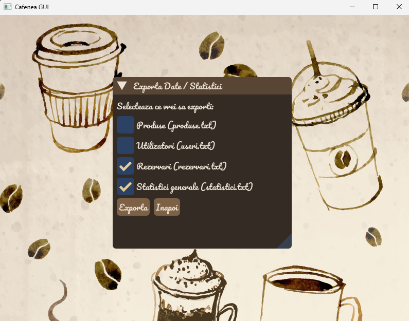
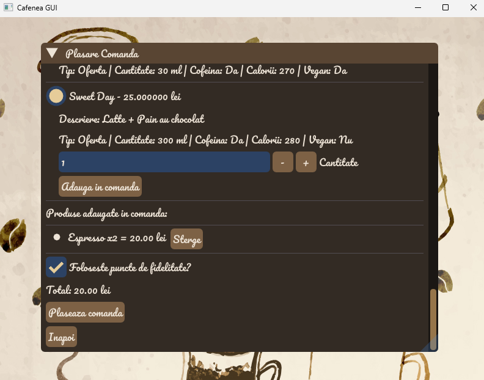
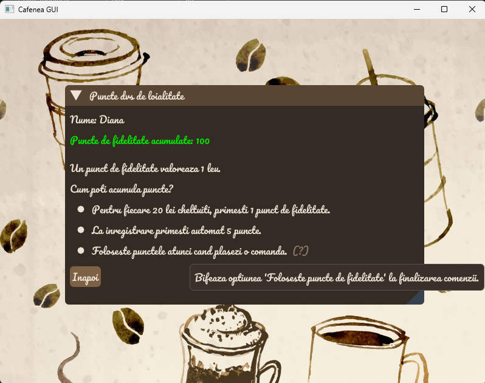

# ☕ Cafe Management System (C++ GUI)

This project is a graphical user interface (GUI) application for managing a virtual coffee shop. It is developed in C++ using ImGui-SFML for the interface and follows object-oriented programming (OOP) principles.

## 🔑 Features

### Users
- Login & registration
- Admin & customer roles
- Loyalty points system (earn/use points)

### Products
- Types: `Drink`, `Food`, `Offer`
- Admin can add, update, delete, import/export products
- Menu grouped by category

### Orders & Reservations
- Place orders with quantity and points usage
- Make, view, and cancel reservations
- Admin can view all reservations

### Statistics
- Export stats (users, products, reservations, summary)

## ⚙️ Tech Stack
- **Language**: C++
- **GUI**: SFML 2.6.1 + ImGui
- **OOP Concepts**: Inheritance, Polymorphism, Operator Overloading, Singleton

## ▶️ Run Instructions
1. Install SFML and ImGui-SFML
2. Compile `main.cpp`
3. Run the app

  
 

  
 

  

  

  

  

  

